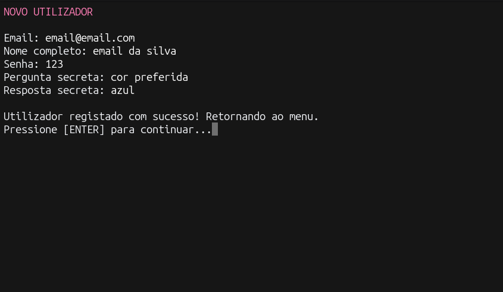
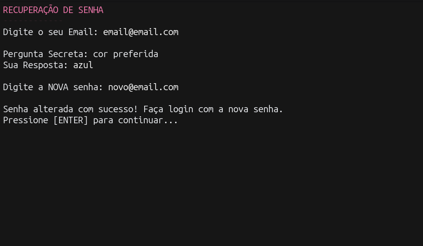
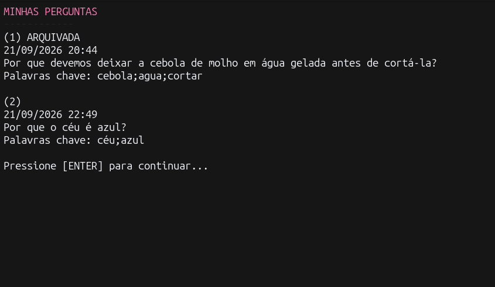

# Ajuda Aí 1.0

Trabalho prático 1 da disciplina de Algoritmos e Estruturas de Dados III (AEDs III) da PUC Minas. 

Este projeto é um sistema de perguntas e respostas executado no terminal. Todo o armazenamento é feito "do zero" utilizando ficheiros binários em Java, sem o uso de bases de dados prontas (como MySQL).

## Integrantes

- Arthur Soares Rolla
- Gabriel Lucas Santos Moura
- Lucas Santiago Pereira
- Matheus Arantes Coimbra

## O que o sistema faz

* **Usuários:** cadastro, login por e-mail e senha, recuperação de senha e consulta por e-mail usando um índice de hash extensível. As senhas são armazenadas como hashes SHA-256 acompanhados de salt.
* **Perguntas:** Criação, listagem, edição e arquivamento das próprias perguntas.
* **Relacionamento:** As perguntas são associadas a cada utilizador através de uma Árvore B+.

## Como compilar e executar

Certifique-se de que tem o Java (JDK) instalado. Abra o terminal na pasta onde está o ficheiro `Principal.java` e digite os seguintes comandos:

1. **Compilar o código:**
   ```bash
   javac Principal.java


## Estrutura do projeto

### Usuários

A classe `Usuario` representa os dados de cada usuário: ID, nome, e-mail, hash da senha, pergunta secreta e hash da resposta secreta. Ela implementa `InterfaceRegistro`, com os métodos `serialize()` e `deserialize()` para converter os dados em bytes e reconstruí-los durante a leitura.

A classe `ArquivoUsuario` estende `Arquivo<Usuario>` e gerencia a persistência dos usuários. O índice indireto de e-mail utiliza `HashExtensivel<ParEmailId>`, associando cada e-mail ao ID do usuário.

### Perguntas

A classe `Pergunta` contém ID, ID do usuário que criou a pergunta, datas de criação e alteração, nota, texto, palavras-chave e estado de atividade. Também implementa `InterfaceRegistro` para permitir seu armazenamento em arquivo. 

A classe `ArquivoPergunta` estende `Arquivo<Pergunta>` e gerencia a inclusão, leitura, alteração e arquivamento das perguntas. Ela recebe uma referência a `ArquivoUsuario` para verificar se o usuário associado à pergunta existe antes de gravá-la.

### Armazenamento e índices

Os registros são armazenados em arquivos com uma lápide, um indicador de tamanho e os bytes da entidade. A classe `Arquivo` mantém um índice direto com `ParIDEndereco`, associando o ID à posição do registro no arquivo.

Além dos índices diretos, o sistema utiliza:

- **Índice de e-mail:** tabela hash extensível com `ParEmailId`, associando e-mail e ID do usuário.
- **Índice do relacionamento:** árvore B+ com `ParIdId`, armazenando os pares `(idUsuario, idPergunta)` para localizar as perguntas de cada usuário.

### Interface e controles

A interface textual é organizada pelas classes `Principal`, `ControleUsuario`, `ControlePergunta` e `Utilidades`. A classe `Principal` inicializa os arquivos de usuários e perguntas, cria os controles e inicia a tela de acesso. A classe `ControleUsuario` organiza o cadastro, o login, a recuperação de senha e a navegação pelos menus “Minha área” e “Meus dados”, além de manter a referência ao usuário autenticado.

A classe `ControlePergunta` apresenta as opções de inclusão, listagem, alteração e arquivamento das perguntas do usuário logado. Na listagem, utiliza números sequenciais e mantém uma associação com os IDs internos, permitindo selecionar uma pergunta sem expor seu identificador na tela. Já a classe `Utilidades` reúne recursos de apresentação, como cores, limpeza da tela e pausas para leitura das mensagens.

## Funcionalidades implementadas

### Cadastro, consulta e alteração de usuários

O cadastro de usuários gera automaticamente o ID e registra o e-mail no índice indireto. Antes da gravação, o CRUD verifica se o e-mail está vazio, se respeita o tamanho permitido pelo índice e se já está cadastrado. A consulta por e-mail busca o endereço completo e retorna o usuário correspondente ou `null`.

Na alteração do e-mail, o sistema verifica a disponibilidade do novo endereço e atualiza o índice, preservando o ID original. Na interface atual, o menu “Meus dados” permite alterar nome e e-mail, enquanto as opções de alteração de senha e de pergunta e resposta secreta ainda apresentam a mensagem de funcionalidade em desenvolvimento.

*(captura de tela mostrando o cadastro de um usuário no terminal)*


### Login e recuperação de senha

O login consulta o usuário pelo e-mail e verifica a senha informada. Quando o acesso é validado, o controle mantém a referência ao usuário autenticado e apresenta o menu principal.A opção “Esqueci a minha senha” solicita o e-mail e apresenta a pergunta secreta cadastrada. Se a resposta for validada, permite definir uma nova senha e grava a atualização no arquivo de usuários. A senha e a resposta secreta são armazenadas como hashes SHA-256 acompanhados de salts aleatórios, sem guardar os textos originais. Os métodos de verificação utilizam o salt armazenado para conferir os dados informados. Antes do cálculo do hash da resposta secreta, são removidos os acentos e as letras são convertidas para minúsculas. Assim, respostas como “São Paulo” e “sao paulo” são consideradas equivalentes.

*(captura de tela mostrando o fluxo de recuperação de senha)*


### Inclusão, listagem, alteração e arquivamento de perguntas

Na inclusão pela interface, o usuário informa o texto e as palavras-chave. O controle utiliza o ID do usuário autenticado, preenche as datas com o horário atual, define a nota inicial como zero e marca a pergunta como ativa. O CRUD gera o ID da pergunta automaticamente. A listagem consulta a árvore B+ para recuperar as perguntas vinculadas ao usuário logado. A tela apresenta números sequenciais, data, texto e palavras-chave.

*(captura de tela mostrando a listagem de perguntas de um usuário, com destaque para a numeração sequencial e o status de arquivamento)*


As perguntas arquivadas recebem a indicação `ARQUIVADA`. A alteração permite modificar o texto e as palavras-chave, atualizando a data de alteração. A interface impede a edição de perguntas já arquivadas. O arquivamento define `ativa` como `false`, mantendo a pergunta armazenada e vinculada ao usuário que a criou. As perguntas arquivadas continuam disponíveis na consulta das próprias perguntas. Não há operação de desarquivamento, e a exclusão comum de perguntas é bloqueada.

### Relacionamento 1:N e integridade dos dados

Cada pergunta possui o atributo `idUsuario`, que identifica o usuário que a criou. Um usuário pode possuir várias perguntas, enquanto cada pergunta pertence a um único usuário. Antes de gravar uma pergunta, `ArquivoPergunta` consulta o arquivo de usuários para verificar se o usuário associado existe. Após a inclusão, registra o par `(idUsuario, idPergunta)` na árvore B+.

As operações de alteração e arquivamento verificam se o ID do usuário solicitante corresponde ao usuário que criou a pergunta. A interface fornece esse ID a partir do usuário autenticado. Na exclusão de um usuário pelo CRUD, o sistema remove suas perguntas, inclusive as arquivadas, e os respectivos vínculos na árvore antes de excluir o usuário e sua entrada no índice de e-mail. Essa rotina não está exposta como uma opção nos menus.

## Checklist

- **Há um CRUD de usuários (que estende a classe Arquivo, acrescentando Tabelas Hash Extensíveis e Árvores B+ como índices diretos e indiretos conforme necessidade) que funciona corretamente?**

  ```text
  SIM

- **Há um CRUD de perguntas (que estende a classe Arquivo, acrescentando Tabelas Hash Extensíveis e Árvores B+ como índices diretos e indiretos conforme necessidade) que funciona corretamente?**

  ```text
  SIM
  
- **As perguntas estão vinculadas aos usuários usando o idUsuario como chave estrangeira?**

  ```text
  SIM
  
- **Há uma árvore B+ que registre o relacionamento 1:N entre usuários e perguntas?**

  ```text
  SIM

- **O trabalho compila corretamente?**

  ```text
  SIM

- **O trabalho está completo e funcionando sem erros de execução?**

  ```text
  SIM

- **O trabalho é original e não a cópia de um trabalho de outro grupo?**

  ```text
  SIM
  

### Vídeo de Demonstração
  - **Link do Youtube**: https://youtu.be/V7aLG8FnlTk
